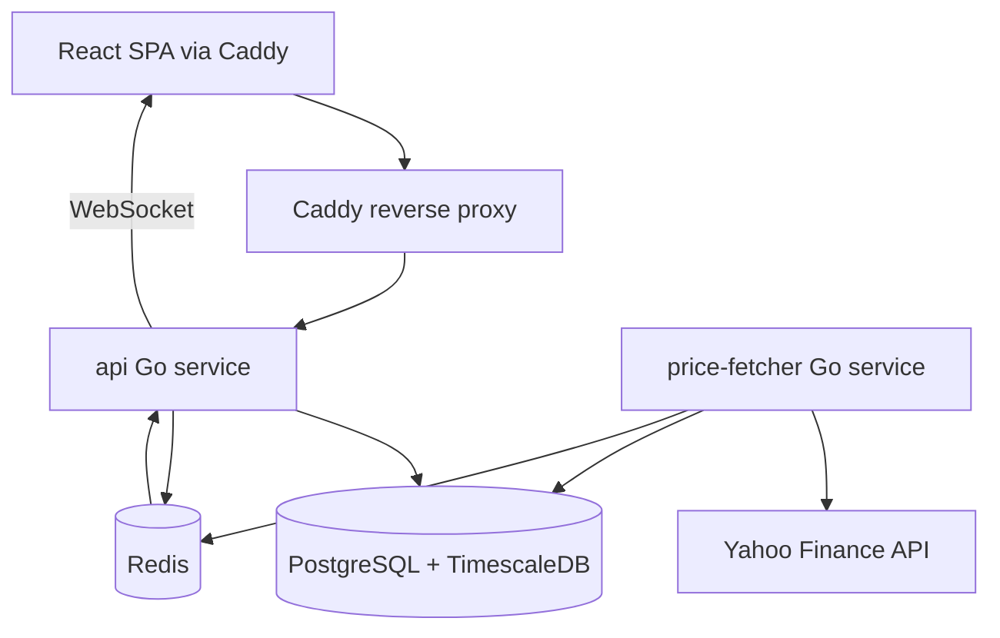

# Börstracker

Real-time stock price monitoring with configurable audio and visual alerts. Anonymous sessions, no login required. Runs entirely in Docker Compose.

## Quick start

```bash
cp .env.example .env
docker compose up -d
```

Open [http://localhost](http://localhost) in your browser.

## Architecture



### Services

| Service | Port (internal) | Role |
|---------|-----------------|------|
| `caddy` | 80/443 | TLS, static frontend, reverse proxy to API |
| `api` | 8080 | REST API, WebSocket, session cookies |
| `price-fetcher` | 8081 | Polls Yahoo Finance every 5s, evaluates alerts |
| `postgres` | 5432 | Sessions, watchlists, alerts, price time series |
| `redis` | 6379 | Price cache (TTL 5s), pub/sub fan-out |

## Configuration

Copy `.env.example` to `.env`. Key variables:

| Variable | Default | Description |
|----------|---------|-------------|
| `DATABASE_URL` | (compose) | PostgreSQL connection string |
| `REDIS_URL` | `redis://redis:6379/0` | Redis URL |
| `FRONTEND_ORIGIN` | `http://localhost` | CORS allowed origin |
| `COOKIE_SECURE` | `false` | Set `true` in production behind HTTPS |
| `SESSION_MAX_AGE_DAYS` | `30` | Rolling session cookie lifetime |
| `POLL_INTERVAL_SEC` | `5` | Yahoo poll interval per symbol set |
| `YAHOO_MAX_CONCURRENCY` | `10` | Max parallel Yahoo requests |
| `API_RATE_LIMIT_PER_MIN` | `60` | Per-session REST rate limit |
| `CADDY_DOMAIN` | `localhost` | Domain for TLS (production) |
| `ACME_EMAIL` | | Let's Encrypt email (production) |

## Adding new data sources

1. Implement `marketdata.Provider` in `backend/internal/marketdata/`.
2. Create a client package (e.g. `internal/stooq/`) with `FetchQuote` and `FetchChart`.
3. Wire the provider in `cmd/price-fetcher/main.go` based on an env var such as `MARKET_DATA_PROVIDER=yahoo|stooq`.
4. Document the new variable in `.env.example`.

## Running tests

### Backend (unit)

```bash
cd backend
go test ./...
go test -cover ./internal/alerts/...
```

### Backend (integration)

```bash
cd backend
go test -tags=integration ./test/integration/...
```

### Frontend

```bash
cd frontend
npm ci
npm test
npm run lint
```

## Scaling notes

- ~1000 WebSocket connections are handled comfortably by a single `api` container (2 CPU, 1 GB RAM).
- Yahoo polling depends on **unique symbols**, not user count.
- Horizontal scaling: run multiple `api` instances; Redis pub/sub already fans out price and alert events.

## Yahoo Finance

Data is fetched from the public chart API (`query1.finance.yahoo.com`). No API key required. If you see sustained 403/429 responses, check logs and consider an alternative provider before increasing poll frequency.

## License

MIT
